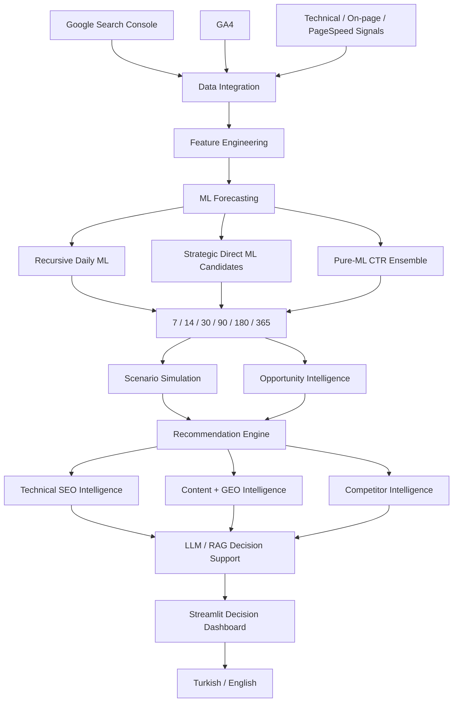

# SEO & GEO Decision Intelligence AI Agent

A production-oriented **SEO, GEO, Machine Learning and LLM decision-intelligence platform** that combines Google Search Console, GA4, technical SEO signals, forecasting, scenario simulation, recommendation logic, RAG and a bilingual Streamlit interface.

The system is designed to move beyond descriptive SEO reporting and support **forward-looking decisions**: what is likely to happen, where the largest organic-growth opportunities are, which pages deserve action first, and how those decisions can be explained to business stakeholders.

---

## Highlights

- **Multi-horizon ML forecasting:** 7, 14, 30, 90, 180 and 365 days
- **Operational + strategic forecasting architecture**
- **Leakage-safe chronological backtesting**
- **Pure-ML 90-day impression ensemble**
- **Guarded strategic ML routing**
- **Scenario simulation and opportunity intelligence**
- **Page, keyword, category and content intelligence**
- **Technical SEO and GEO intelligence**
- **LLM + RAG decision support**
- **Turkish / English Streamlit dashboard**
- **PostgreSQL-ready persistence**
- **Docker support**
- **Automated final QA**
- **Sanitized public demo dataset**

---

## Problem

Traditional SEO dashboards mostly explain what already happened.

This project was built to answer more decision-oriented questions:

- Which pages are most likely to gain or lose organic visibility?
- What do 7-day, 30-day, 3-month, 6-month and 1-year trajectories look like?
- Which opportunities deserve attention first?
- How reliable is a forecast at each horizon?
- Can technical, content, GEO and performance signals be evaluated together?
- Can model output be translated into understandable executive recommendations?

---

## System Architecture



---

## ML Forecasting Design

The production forecasting architecture intentionally does **not** treat all horizons as identical.

### Operational horizons

**7 / 14 / 30 days**

These horizons use a recursive daily ML path. A genuine next-calendar-day model generates the next day, then the new state is recursively fed into later steps.

### Strategic horizons

**90 / 180 / 365 days**

Strategic horizons use guarded ML routing.

- Direct strategic models may be evaluated.
- Unsafe tail-scaling is rejected by production guardrails.
- When a direct strategic target is not safe, the route falls back to the recursive ML path.
- 90-day impressions can use a **pure-ML CTR ensemble**.
- 365 days remain ML-based but are explicitly marked as historically unvalidated because available Search Console history is insufficient for a leakage-safe 365-day train + 365-day holdout.

This avoids presenting long-horizon forecasts with more certainty than the data supports.

---

## Backtesting

Backtesting is chronological and designed to avoid target leakage.

### Historical Search Console research dataset

- **499 calendar days**
- **2025-04-05 → 2026-08-16**
- **742,200 page-day rows**
- **8,437 pages**

The available Search Console history was sufficient for operational and strategic 90/180-day research, but not for an unbiased 365-day train + 365-day holdout.

### Operational forecast performance

| Horizon | Click Total Error | Click WAPE | Impression Total Error | Impression WAPE |
|---:|---:|---:|---:|---:|
| 7 days | 1.21% | 5.51% | 0.87% | 3.88% |
| 14 days | 1.89% | 5.59% | 2.14% | 3.87% |
| 30 days | 4.77% | 9.94% | 2.50% | 7.01% |

### Strategic baseline

| Horizon | Click Total Error | Click WAPE | Impression Total Error | Impression WAPE |
|---:|---:|---:|---:|---:|
| 90 days | 13.77% | 25.44% | 68.68% | 68.90% |
| 180 days | 25.28% | 29.64% | 9.59% | 24.82% |

The original 90-day impression path was not accepted as strong enough. A separate pure-ML CTR architecture was then developed.

### Pure-ML 90-day impression architecture

Models evaluated:

- Ridge
- Gradient Boosting
- Random Forest
- Histogram Gradient Boosting

Pre-cutoff out-of-fold selection and bias correction were used before the final holdout.

Final 90-day impression result:

- **Total error: 28.58%**
- **WAPE: 34.14%**
- Production promotion gate: **passed**

More detail is available in [`docs/engineering/ML_BACKTESTING.md`](docs/engineering/ML_BACKTESTING.md).

---

## Production Guardrails

A strategic forecast is not promoted only because a research model produces a numerically attractive target.

The production router checks whether the requested adjustment can be applied without destabilizing the already validated short-term path.

In the final accepted production design:

- 90-day click direct ML target hit the guardrail → `RecursiveDailyML`
- 90-day impressions → `MLOnlyCTREnsembleImpressions`
- 180-day click direct ML target hit the guardrail → `RecursiveDailyML`
- 180-day impressions → `RecursiveDailyML`
- 365-day route → ML hybrid with explicit validation limitation

All six primary forecast horizons remain **ML-based**.

---

## Final Automated QA

Final release validation:

- Python compile: **PASS**
- Pipeline data validation: **PASS**
- Final automated tests: **123 passed**
- ML daily horizon coverage: **1 → 365**
- Portfolio horizons: **7 / 14 / 30 / 90 / 180 / 365**
- Negative ML forecasts: **none**
- Daily page + forecast-date key: **unique**
- CTR consistency validation: **PASS**
- Engagement-rate validation: **PASS**
- Multi-horizon dashboard contract: **PASS**

Final pipeline snapshot:

- Integrated rows: **36,735**
- Scenario rows: **14,187**
- Recommendation rows: **1,578**
- ML daily forecast rows: **688,025**
- Next-day target validation R² range: **0.9693 → 0.9870**

> The R² values above refer to next-day target validation and are not presented as 90/180/365-day forecast accuracy.

See [`docs/engineering/FINAL_QA.md`](docs/engineering/FINAL_QA.md).

---

## Automated Multi-Horizon Smoke Test

A dedicated automated check verifies that:

- exactly six horizon rows exist
- daily ML output covers day 1 through day 365
- each portfolio horizon reconciles with the cumulative daily forecast
- 30 → 90 → 180 → 365 values actually change
- cumulative clicks and impressions grow with horizon length
- all primary routes are marked as ML
- 365 remains explicitly `Unvalidated-HistoryTooShort`
- the dashboard exposes 7/14/30/90/180/365 options
- AI Insights reads multi-horizon ML outputs

Final result:

```text
[PASS] All ML horizon automatic smoke checks passed.
```

---

## Decision Intelligence Modules

### Executive Overview
Business-level KPI summaries, trends and performance signals.

### Page Analysis
Page-level performance diagnostics and decision support.

### SEO Opportunity Optimizer
Opportunity prioritization using performance, forecasting and business logic.

### AI Insights
Multi-horizon ML forecast center with operational and strategic forecast views.

### Ask AI
LLM / RAG-powered analytical interface with deterministic fallback logic.

### Technical SEO
Crawl, technical signals and prioritization.

### Content + GEO Intelligence
Content-to-commerce, keyword/content gaps and generative-engine visibility signals.

### Competitor Intelligence
Competitive performance context and opportunity analysis.

---

## LLM + RAG Layer

The project includes a provider-independent architecture for:

- Anthropic
- OpenAI
- Google Gemini

It also includes:

- usage guard logic
- deterministic fallback
- RAG ingestion
- chunking
- embeddings
- retrieval
- PostgreSQL / pgvector-ready knowledge storage

The public demo does not require production API credentials.

---

## Public Demo Data

The repository includes a separate sanitized demo layer.

Demo release snapshot:

- **114 sanitized CSV files**
- **17,790 demo rows**
- **15 anonymized page identities**
- real client URLs replaced with `demo.example.com`
- search queries anonymized
- products/categories/organization identifiers anonymized
- numerical business values transformed

The demo is intended to demonstrate application behavior and architecture. Demo numbers are **not exact production business results**.

Security details: [`docs/engineering/PUBLIC_DEMO_SECURITY.md`](docs/engineering/PUBLIC_DEMO_SECURITY.md).

---

## Project Structure

```text
.
├── config/
├── dashboard/
│   ├── components/
│   ├── pages/
│   └── services/
├── docker/
├── outputs/                  # sanitized public demo outputs
├── scripts/
├── src/
│   ├── extract/
│   ├── features/
│   ├── llm/
│   ├── memory/
│   ├── models/
│   ├── rag/
│   ├── recommendations/
│   ├── reporting/
│   ├── utils/
│   └── warehouse/
├── tests/
│   └── final_qa/
├── Dockerfile
├── docker-compose.yml
├── main.py
└── requirements.txt
```

---

## Run Locally

### 1. Clone

```bash
git clone https://github.com/ozlemtonbul/seo-organic-growth-ml-llm-intelligence-ai-agent.git
cd seo-organic-growth-ml-llm-intelligence-ai-agent
```

### 2. Install dependencies

```bash
pip install -r requirements.txt
```

### 3. Run dashboard

```bash
python -m streamlit run dashboard/app.py
```

---

## Run Tests

Final QA:

```bash
python scripts/run_final_qa.py
```

Multi-horizon automatic smoke check:

```bash
python scripts/validate_ml_horizon_behavior.py
```

Full pytest suite:

```bash
python -m pytest -q
```

---

## Docker

```bash
docker compose up --build
```

Stop:

```bash
docker compose down
```

---

## Security & Privacy

The public repository intentionally excludes production secrets and confidential source data.

Excluded or sanitized items include:

- `.env`
- API keys and tokens
- service-account JSON
- production database dumps
- private raw datasets
- private historical extracts
- local logs
- local backups
- virtual environments
- caches
- local patch archives

The included `outputs/` directory contains **sanitized demo data**, not the production dataset.

---

## Engineering Principles Demonstrated

This project emphasizes:

- production-oriented ML rather than notebook-only modeling
- chronological validation
- leakage prevention
- explicit model limitations
- guarded production routing
- reproducible automated QA
- multilingual product design
- explainable business-oriented outputs
- privacy-aware public demo engineering
- separation of deterministic logic and LLM commentary

---

## Current Status

| Capability | Status |
|---|---|
| GSC integration | ✅ Implemented |
| GA4 integration | ✅ Implemented |
| Feature engineering | ✅ Implemented |
| ML forecasting | ✅ Implemented |
| 7/14/30-day operational forecasting | ✅ Backtested |
| 90/180-day strategic forecasting | ✅ Backtested |
| 365-day ML forecasting | ⚠️ Implemented; historical validation pending |
| Pure-ML CTR ensemble | ✅ Implemented |
| Strategic ML guardrails | ✅ Implemented |
| Scenario simulation | ✅ Implemented |
| Recommendation engine | ✅ Implemented |
| Technical SEO intelligence | ✅ Implemented |
| Content + GEO intelligence | ✅ Implemented |
| RAG architecture | ✅ Implemented |
| Multi-LLM architecture | ✅ Implemented |
| Streamlit dashboard | ✅ Implemented |
| Turkish / English UI | ✅ Implemented |
| PostgreSQL support | ✅ Implemented |
| Docker support | ✅ Implemented |
| Sanitized public demo | ✅ Implemented |
| Final automated QA | ✅ 123 passed |

---

## Author

### Özlem Tonbul

**AI & Data Intelligence · AI Agents · LLMs · Machine Learning · Growth Analytics · SEO Intelligence**

Portfolio: `ozlemtonbul.com`  
GitHub: `github.com/ozlemtonbul`  
LinkedIn: `linkedin.com/in/ozlemtonbul`

---

## License

This repository is provided as a professional engineering and portfolio project.

Production credentials, private datasets and confidential business information are intentionally excluded.
